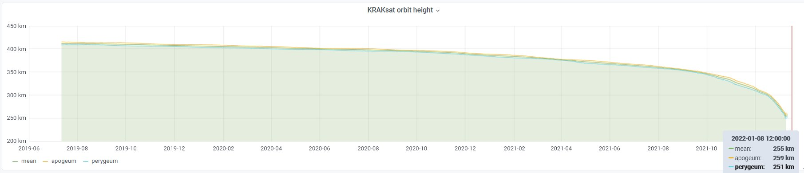

# Satellite orbit height

### ◾ Requirements
- Python >= 3.8
- Packages listen in `reuirements.txt` (run `pip install -r requirements.txt`)
- Account on [Space Track](https://www.space-track.org/)

### ◾ How to use?

This small script allows you to download TLEs from the chosen period for any satellite from Space Track, and prepare a CSV in format `DATE;HEIGHT` that can be then used to create a chart in any software  you want.

Usage:
1. Run `pip install -r requirements.txt`.
2. Fill file `config.py`.
3. Run `python script.py`.

Output:
1. `SATELLITE_NAME_TLE.tle` - all TLE from the chosen time period for specific satellite.
2. `SATELLITE_NAME_height.csv` - file with `DATE;HEIGHT` from the chosen time period.

